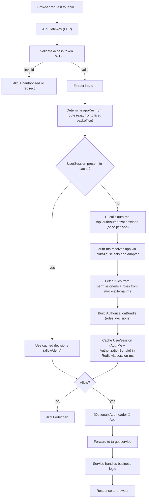
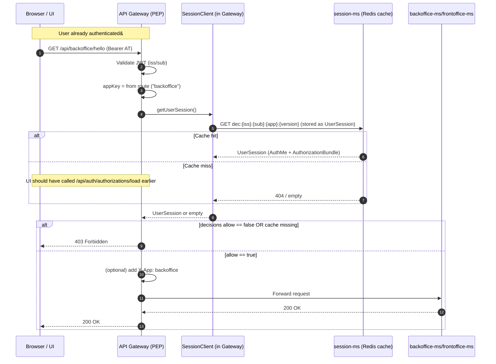
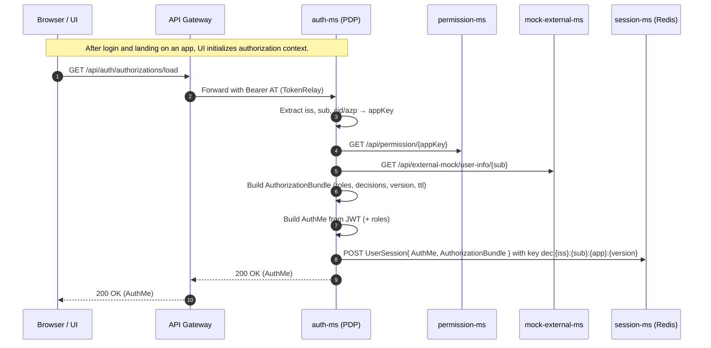
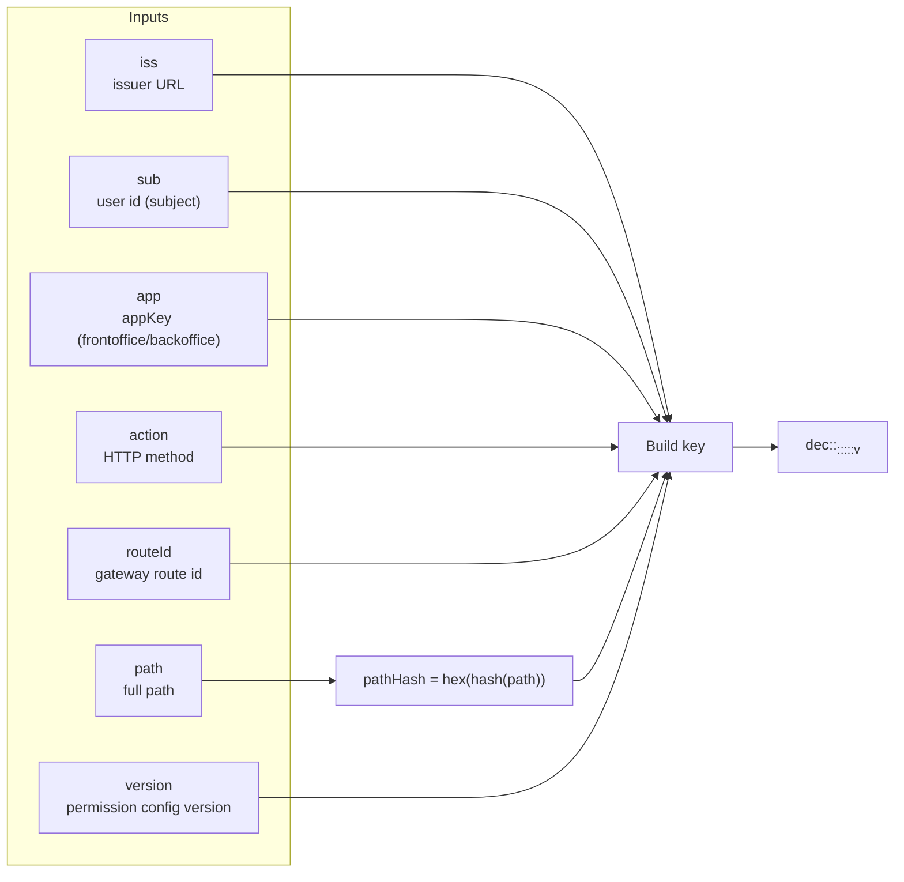
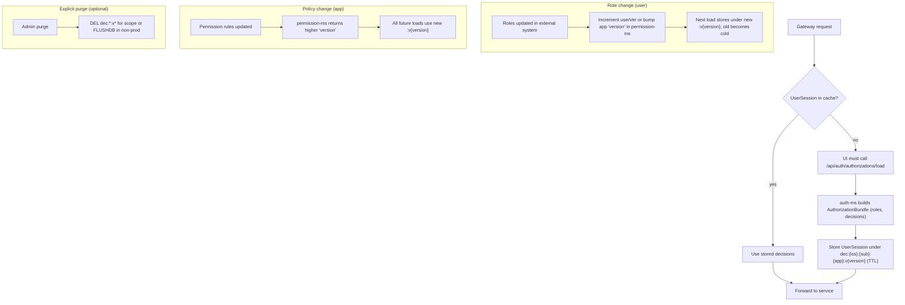

# Authorization & Caching Architecture

This document describes the **authorization flow**, **decision caching**, and **per-application session handling** for the SSO demo architecture.  
The solution follows a **PEP/PDP pattern** where:

- **API Gateway (PEP)** enforces access decisions.
- **auth-ms (PDP)** builds per-app authorization data and caches it.
- **session-ms** persists user authorization bundles (`UserSession`) in Redis.

---

## Overview

Each UI (e.g., **frontoffice**, **backoffice**) authenticates via Okta and receives an **access token** (AT).  
After login:

1. The UI calls `auth-ms /api/auth/authorizations/load` (through the Gateway) once per app.
2. `auth-ms` builds the **AuthorizationBundle** (roles + decisions) using:
    - `permission-ms` → fetch app-level policy rules.
    - `mock-external-ms` → fetch user roles by subject.
3. It builds an `AuthMe` object (from JWT + roles) and stores both into Redis via `session-ms`.
4. The **Gateway** retrieves cached data on every request via `SessionClient.getUserSession()` and enforces allow/deny.

---

## 1️⃣ Activity — Gateway ↔ auth-ms Decision Flow

---

## 2️⃣ Sequence — Per-Request Authorization with Cached Decisions

---

## 3️⃣ Sequence — Login / Bootstrap & Roles Caching

---

## 4️⃣ Decision Cache Key Composition (Per-App)

> For the **UserSession bundle**, the gateway may also store a coarse-grained key:  
> `dec:<iss>::<app>:v<version>`  
> and perform local decision matching on each request.
---

## 5️⃣ Eviction & Versioning Flows

---

## 6️⃣ Implementation Notes

- `AuthzCacheKey` must include **app** (and ideally **version**):  
  `roles:{iss}:{sub}:{app}` or `roles:{iss}:{sub}:{app}:{version}`  
  → Fixes earlier bug where cache collided across applications.
- Gateway filter now:
    - Uses `req.getMethod().name()` instead of `getMethodValue()`.
    - Calls `sessionClient.getUserSession()` to fetch cache.
    - Enforces with `PathPatternParser` match.
- Only `X-App` header is forwarded (roles not propagated).
- TTL is defined per-bundle via `AuthorizationBundle.ttlSec`.

---

**Result:**  
Each app now has isolated, versioned cache keys.  
Auth decisions are computed once per login (per app), cached in Redis, and transparently enforced at the Gateway.
