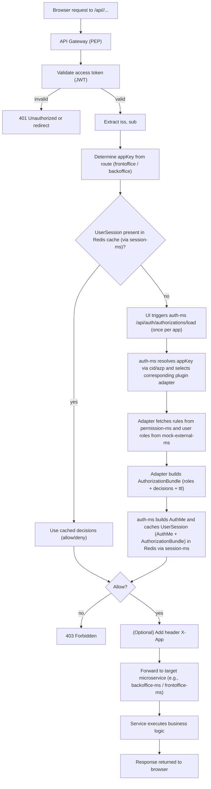
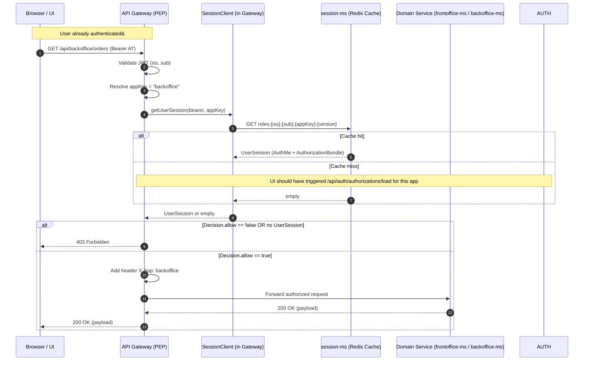
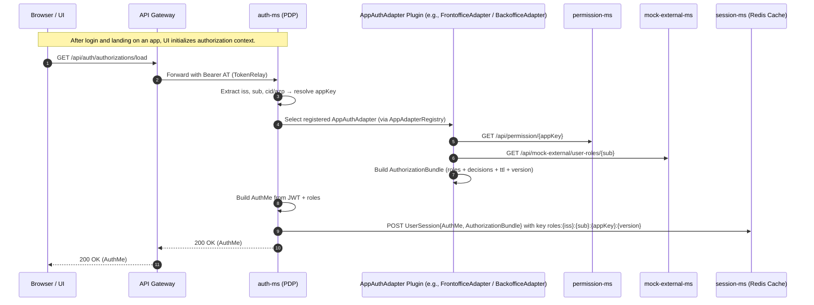
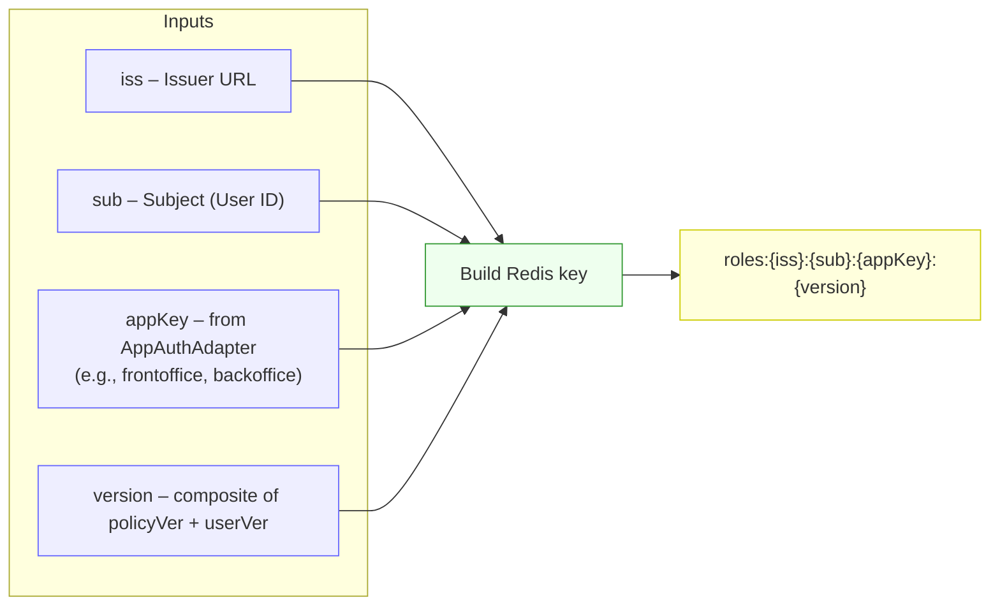
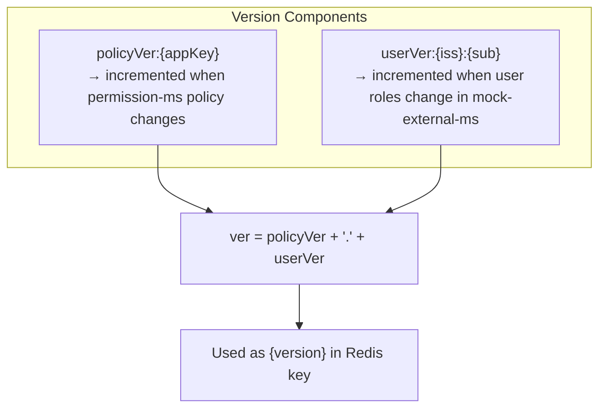

## Authorization Flow — Modular Plugin Architecture

auth-ms functions purely as a PDP (Policy Decision Point) and dynamically loads pluggable AppAuthAdapters 
from domain-specific JARs (e.g. frontoffice-plugin, backoffice-plugin).
Each adapter defines how to fetch user roles (via MockExternalSvcClient) and how to interpret permissions for its own domain.
This preserves a clean separation between shared security infrastructure and domain-specific logic.

### 1) Activity Diagram — Gateway (PEP) ↔ auth-ms (PDP) with Plugin Adapters

### 2) Sequence Diagram — Per-Request Authorization with Cached Decisions

### 3) Sequence Diagram — Login / Bootstrap & Roles Caching (iss + sub + app + version)

####  Design Highlights

| Layer                      | Responsibility                                                    | Notes                                                                     |
| -------------------------- | ----------------------------------------------------------------- | ------------------------------------------------------------------------- |
| **API Gateway (PEP)**      | Enforces access via the `Decide` filter using cached UserSessions | Uses `SessionClient` to talk to `session-ms`                              |
| **auth-ms (PDP)**          | Centralized decision point; loads per-app adapters dynamically    | No dependency on domain/business microservices                            |
| **AppAuthAdapter Plugins** | Domain-aware adapters providing custom decision logic             | Each implements `AppAuthAdapter` and is registered via `@AppKey("<app>")` |
| **permission-ms**          | Stores app-level permission rules                                 | Independent of auth-ms                                                    |
| **mock-external-ms**       | Provides user role data per subject (mock external identity)      | Not secured; pluggable for future identity sources                        |
| **session-ms**             | Caches `UserSession` (AuthMe + AuthorizationBundle)               | Keyed by `iss:sub:app:version`                                            |

#### Benefits of the Plugin-Based PDP Design
 * **Decoupled architecture**: auth-ms is generic and agnostic of any business domain.
 * **Pluggable onboarding**: new app teams (e.g., trainingoffice, analytics) just build their own adapter JAR implementing AppAuthAdapter.
 * **Centralized decision caching**: unified Redis structure for all apps.
 * **No circular dependencies**: shared modules never depend on business modules.
 * **Independent deployment**: new plugins can be deployed by updating the auth-ms container image with the new adapter JAR.

### 4) Redis Key Schema & Versioning Flow (Plugin-Based PDP) - Not Fully Implemented Yet

#### Cache Key Composition — per app, user, and version

 * **Purpose**: uniquely identifies a cached UserSession (AuthMe + AuthorizationBundle).
 * **Namespace prefix**: roles: or dec: depending on context (role set vs. fine-grained decision).
 * **Version**: avoids collisions when either user roles or policy rules change.

#### Version Composition

Both policyVer and userVer are small integers stored separately in Redis or a DB; combining them ensures 
that any change in either policy or user state invalidates cached sessions automatically.

#### Eviction / Invalidation Flow

```mermaid
flowchart TD
    subgraph CacheLookup
        A["Gateway receives request"] --> B{"roles:{iss}:{sub}:{app}:{ver} in Redis?"}
        B -- "yes" --> C["Use cached UserSession"]
        B -- "no" --> D["Call auth-ms /authorizations/load"]
        D --> E["Adapter builds AuthMe + AuthorizationBundle"]
        E --> F["Cache roles:{iss}:{sub}:{app}:{ver} with TTL"]
        C --> G["Forward to target microservice"]
        F --> G
    end

    subgraph RoleChange["User Role Change (External)"]
        RC1["mock-external-ms updates user roles"]
        RC2["Increment userVer:{iss}:{sub}"]
        RC3["Old cache keys (with previous ver) expire naturally"]
    end
    RC1 --> RC2 --> RC3

    subgraph PolicyDeploy["Policy Change (Per App)"]
        PC1["permission-ms deploys new rules"]
        PC2["Increment policyVer:{app}"]
        PC3["Next auth-ms load creates fresh ver"]
    end
    PC1 --> PC2 --> PC3

    subgraph ManualEvict["Explicit Eviction (Optional)"]
        EV1["Admin triggers cache purge"]
        EV2["DEL roles:*:{app}:* or FLUSHDB (non-prod)"]
    end
    EV1 --> EV2
```

#### Design Highlights

| Aspect                  | Description                                                                         |
| ----------------------- | ----------------------------------------------------------------------------------- |
| **Scope**               | Cached per `iss + sub + appKey + version`                                           |
| **Storage**             | Central Redis (`session-ms`)                                                        |
| **Update triggers**     | Role changes (mock-external-ms) or policy updates (permission-ms)                   |
| **TTL**                 | Typically 15 min – 1 h (depending on `auth-ms.yml`)                                 |
| **Eviction safety**     | Old keys naturally expire; new `ver` ensures soft invalidation without flush        |
| **Plugin independence** | Each AppAuthAdapter manages its own policyVer namespace → no cross-app interference |

#### Result:
This key-version scheme guarantees that all cached authorization decisions are both per-application and time-bounded, 
while still allowing independent evolution of user data and policy rules—no shared-module ↔ domain-module coupling.
