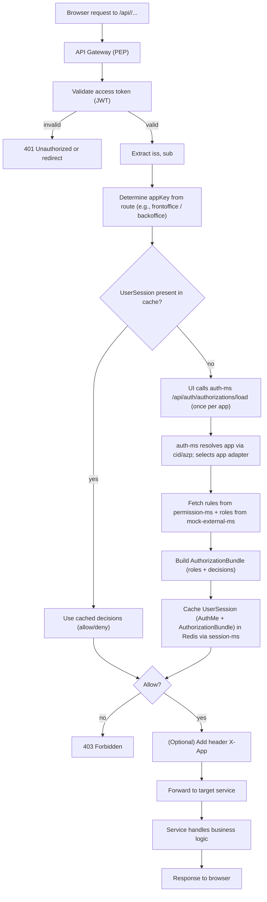
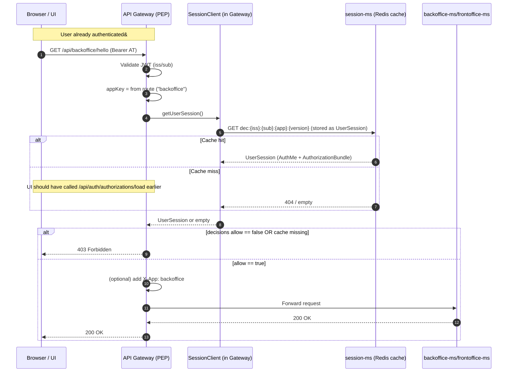
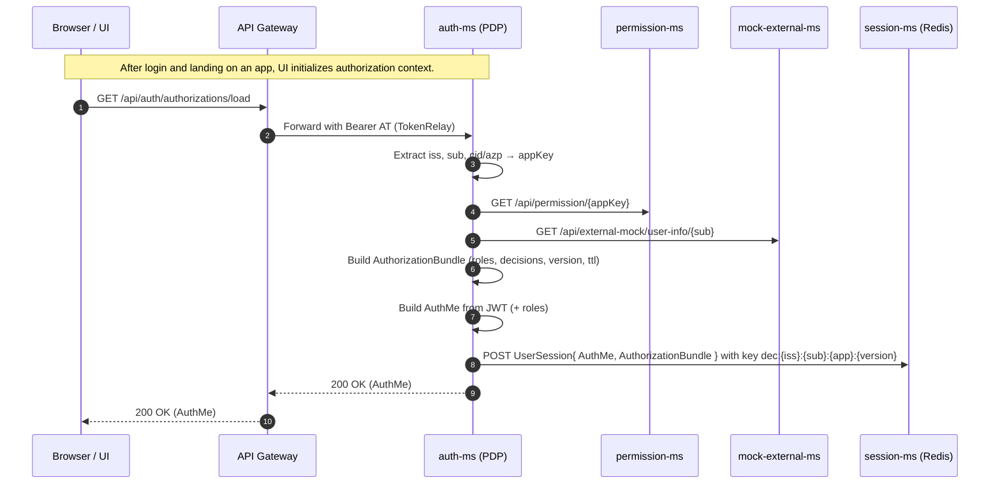

1) Activity diagram — Gateway (PEP) ↔ auth-ms (PDP) decision flow

2) Sequence diagram — per-request authorization with caching

3) Sequence diagram — login/bootstrap & roles caching (iss + sub + app + version)

