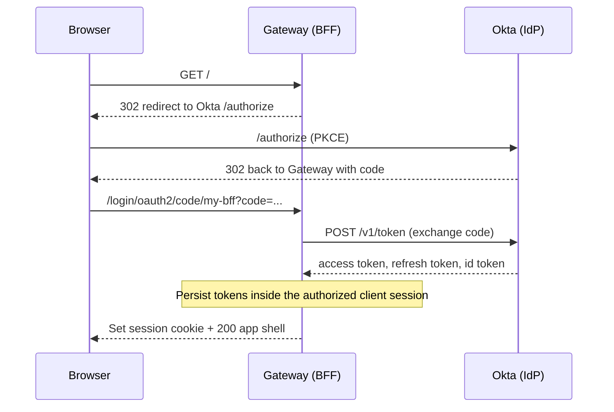
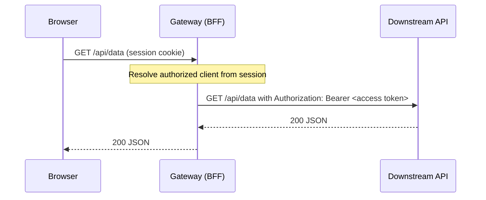
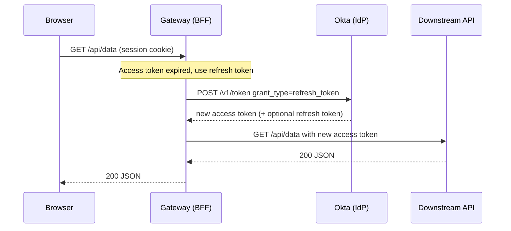
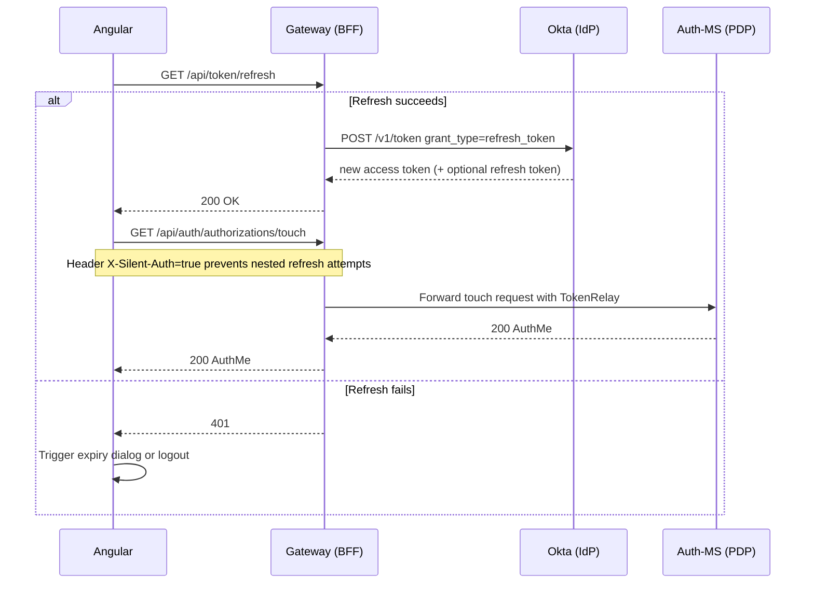
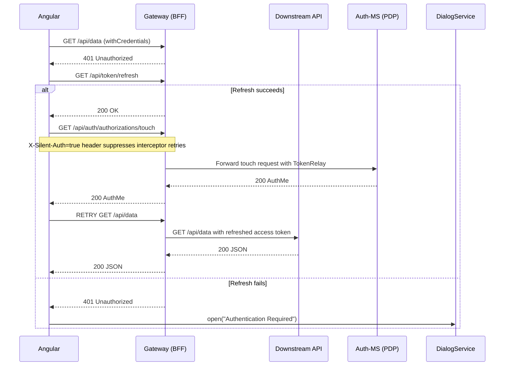
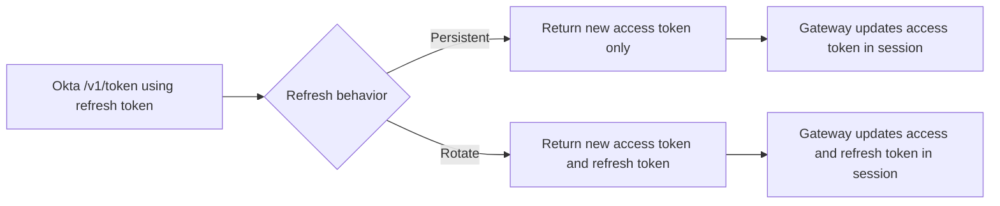
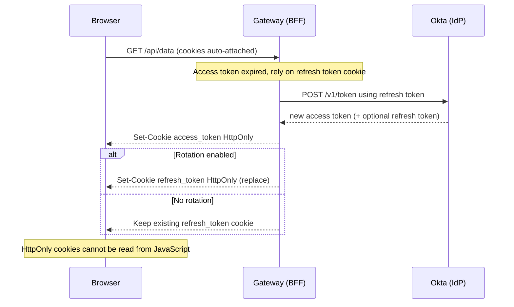

# Okta Token Refresh Flows - Mermaid Diagrams

This document describes how the session-aware Angular frontends interact with the Spring Cloud Gateway (BFF) and Okta. All flows reflect the current `common-lib` implementation (refresh endpoint, silent header, retry logic).

---

## 1) First Login (OIDC Authorization Code with PKCE)

---

## 2) Normal API Call (access token still valid)

---

## 3) Automatic Refresh on Gateway (access token expired)

---

## 4) Angular Keep-Alive (activity or session timer)

---

## 5) Http Interceptor (401 -> refresh -> touch -> retry)

---

## 6) Refresh Token Rotation vs Persistent

---

## 7) Alternative Model - HttpOnly cookies for access/refresh tokens

