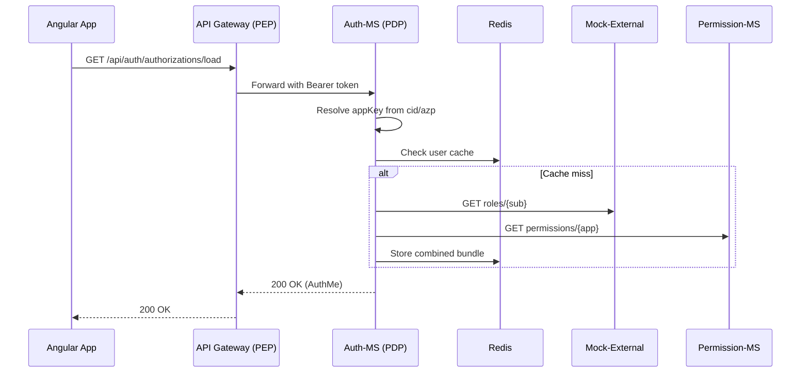
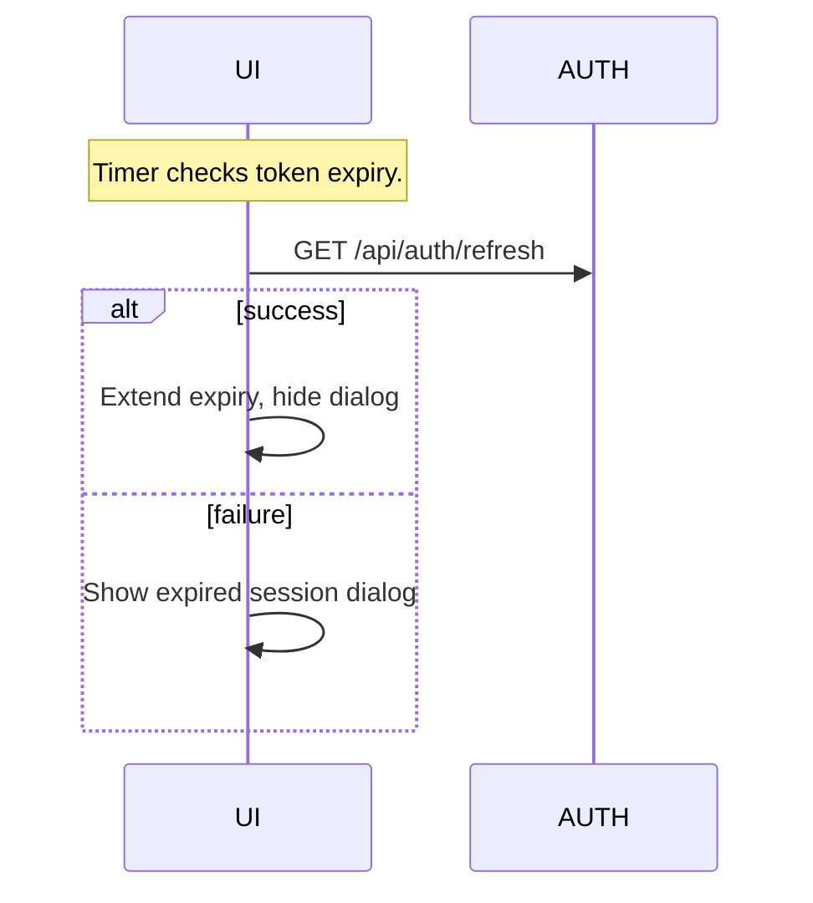
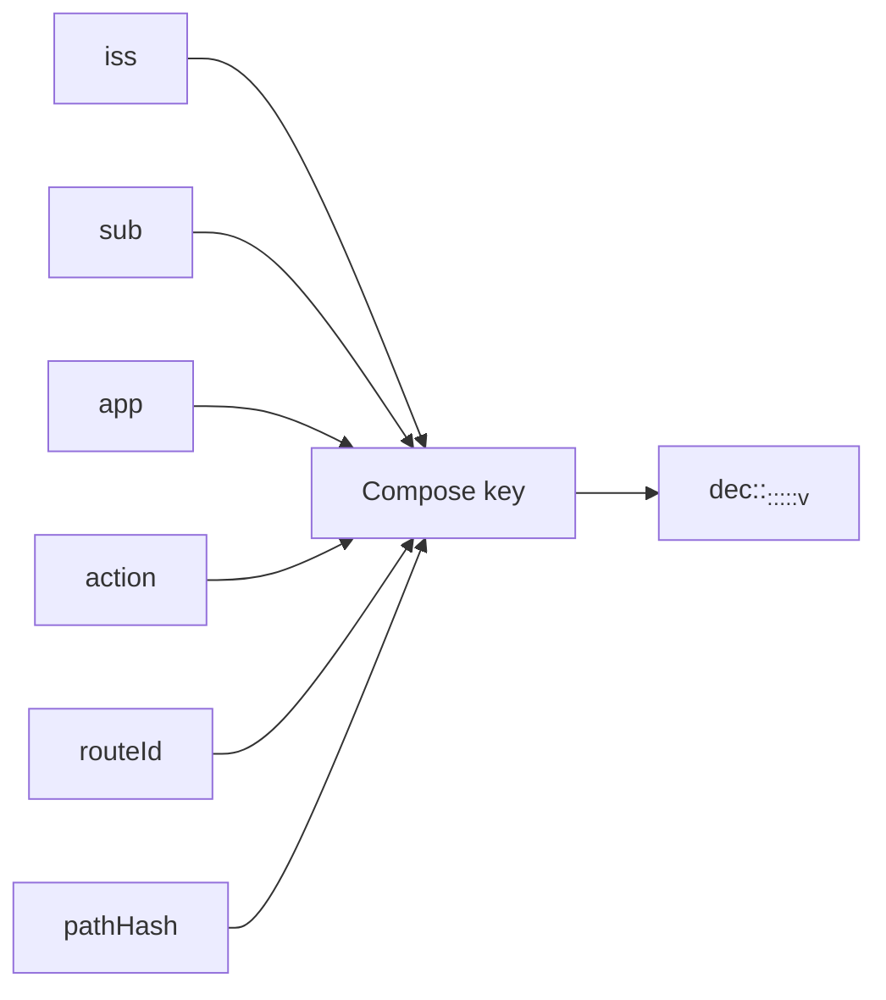

# 🧩 SSO-Demo — Secure Microservices Architecture with Okta & Redis

This repository demonstrates a **Single Sign-On (SSO)** and **centralized authorization** architecture for multiple Spring Boot microservices and Angular frontends, integrating with **Okta** and using **Redis** for session caching.

---

## 🚀 Overview

The system simulates enterprise-grade identity and access management, consisting of:

* **Okta** for user authentication and identity federation.
* **API Gateway** as a centralized **Policy Enforcement Point (PEP)**.
* **Auth-MS** as the **Policy Decision Point (PDP)**.
* **Session-MS** for authorization cache persistence.
* **Permission-MS** for per-application RBAC policies.
* **Mock-External-MS** simulating external user role sources.
* **Angular UI apps** (`myb-ui`, `sada-ui`) demonstrating SSO behavior.

---

## 🔐 Authentication & SSO

* Integrated with **Okta OAuth2/OpenID Connect** using the **Authorization Code Flow**.
* Supports multiple applications (`myb`, `sada`) under one Okta org.
* Shared login session across apps (SSO) via `api-gateway`.
* Automatic **token refresh** and **session countdown dialogs** in UI.

---

## 🧭 API Gateway (PEP)

* Built with **Spring Cloud Gateway (WebFlux)**.
* Routes secured via **TokenRelay**.
* Custom `DecideGatewayFilterFactory` enforces authorization decisions.
* Calls `session-ms` to validate cached decisions (Redis-based).
* Adds normalized headers like `X-App` for downstream services.

### Gateway Route Example

```yaml
spring:
  cloud:
    gateway:
      routes:
        - id: backoffice
          uri: lb://backoffice-ms
          predicates: [ Path=/api/backoffice/** ]
          filters:
            - TokenRelay
            - name: Decide
              args:
                app: backoffice
```

---

## 🧠 Auth-MS (PDP)

* Central **Policy Decision Point** for authorization evaluation.
* Retrieves per-application policies from `permission-ms`.
* Gets user role data from `mock-external-ms`.
* Combines into an `AuthorizationBundle` (user + rules + roles).
* Caches decisions in Redis through `session-ms`.

### Example Flow



---

## 💾 Session-MS

* Manages **Redis-based cache** for authorization bundles.
* Key format: `roles:<iss>:<sub>:<app>`.
* Provides APIs to store and retrieve user authorization data:

  * `POST /api/session/cache/authorizations`
  * `GET /api/session/cache/authorizations`

---

## ⚙️ Permission-MS

* Holds **static RBAC configurations** for each application.
* Configured in YAML using `@ConfigurationProperties`.

```yaml
mock:
  permissions:
    - app: backoffice
      version: "2025-10-27T10:00:00Z"
      rules:
        - action: GET
          resource: /api/backoffice/payments
          roles: [CLIENT, APPLICANT]
        - action: POST
          resource: /api/backoffice/order
          roles: [USER]
```

---

## 👤 Mock-External-MS

* Simulates external user roles based on Okta subject or email.
* Configurable in YAML:

```yaml
mock:
  users:
    aaa%40test.com: [ADMIN, USER]
    bbb%40test.com: [USER]
```

* API: `GET /api/external-mock/user-info/{sub}` returns list of roles.

---

## 🖥️ Angular UI Applications

Workspace: `ui-workspace/`

* `myb-ui` and `sada-ui` as standalone Angular 19 apps.
* Shared `common-lib` for Auth, Interceptors, and Dialog services.
* Implements:

  * Login/logout detection.
  * `/bootstrap` call to initialize Auth state.
  * Session timeout countdown.
  * Activity-based token refresh.
  * Shared SSO behavior across apps.

### Session Countdown



---

## ☁️ Cloud Configuration

* Centralized **Spring Cloud Config Server** hosting:

  * `auth-ms.yml`
  * `permission-ms.yml`
  * `mock-external-ms.yml`
  * `session-ms.yml`
  * Shared configuration file `shared.yml`

* Eureka Discovery for microservice registration.

---

## 🧱 Redis Caching Strategy

### Decision Key Composition



### Versioning

* `policyVer:<app>` — incremented on policy change.
* `userVer:<iss>:<sub>` — incremented when user roles change.
* Cache invalidation happens transparently via version mismatch.

---

## 🧩 Common-Lib

* Shared DTOs and utilities:

  * `AuthMe`, `UserSession`, `AuthorizationBundle`
  * `AuthzCacheKey` (uses iss+sub+app)
  * `DownstreamProperties`
* Used by all microservices.

---

## 🧩 Tech Stack Summary

| Layer          | Technology                        |
| -------------- | --------------------------------- |
| Authentication | Okta OAuth2 / OIDC                |
| Gateway        | Spring Cloud Gateway (WebFlux)    |
| Backend        | Spring Boot 3.5+, Java 17         |
| Config         | Spring Cloud Config Server        |
| Discovery      | Eureka Server                     |
| Cache          | Redis (Jedis + Spring Data Redis) |
| Frontend       | Angular 19, Bootstrap, Material   |
| Shared Lib     | Maven multi-module project        |

---

## 🧰 Future Enhancements

* Add fine-grained ABAC / OPA policy engine integration.
* Support dynamic external API role sync.
* Extend SSO to additional frontend apps (frontoffice, backoffice, etc.).
* Add UI for policy visualization and cache management.

---

## 📜 License

This demo project is intended for **educational and enterprise architecture demonstration purposes** only.

---

**Author:** Daniel Xu
**Project:** SSO-Demo
**Version:** 1.0.0
**Updated:** October 2025
