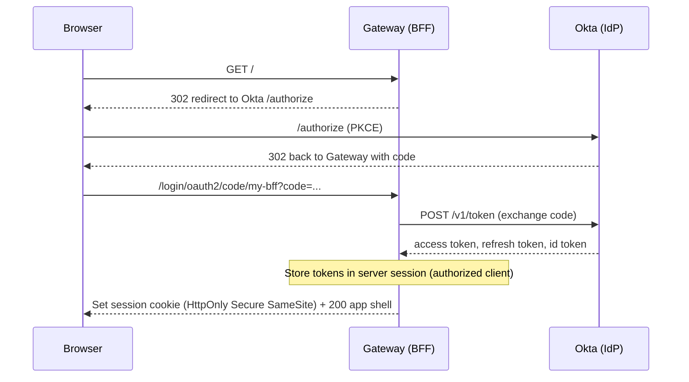
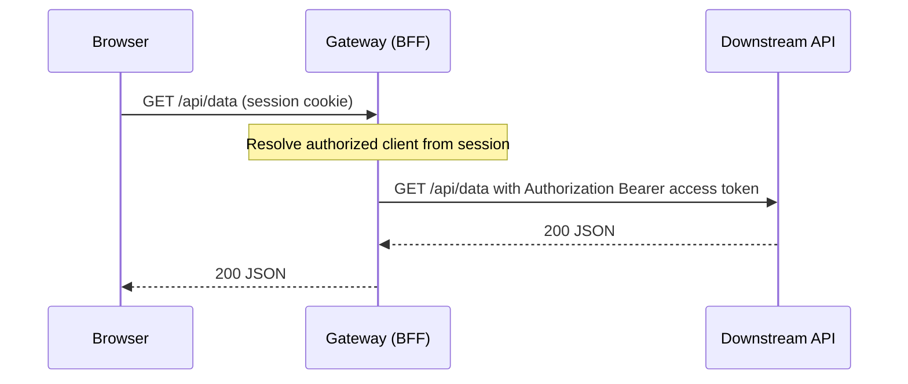
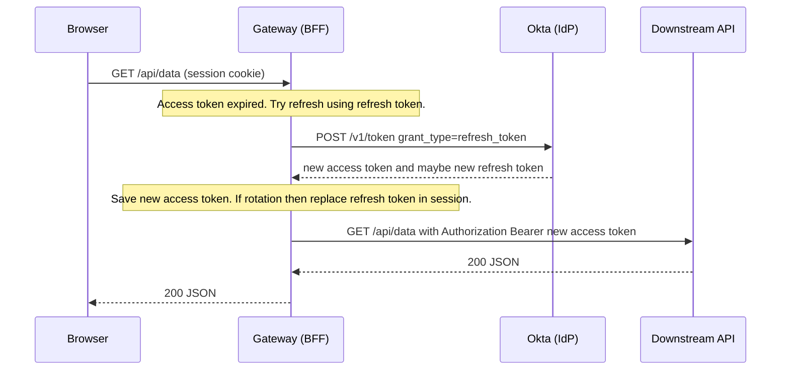
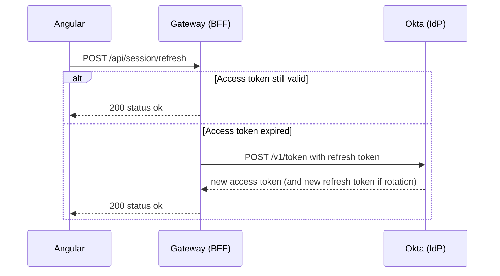
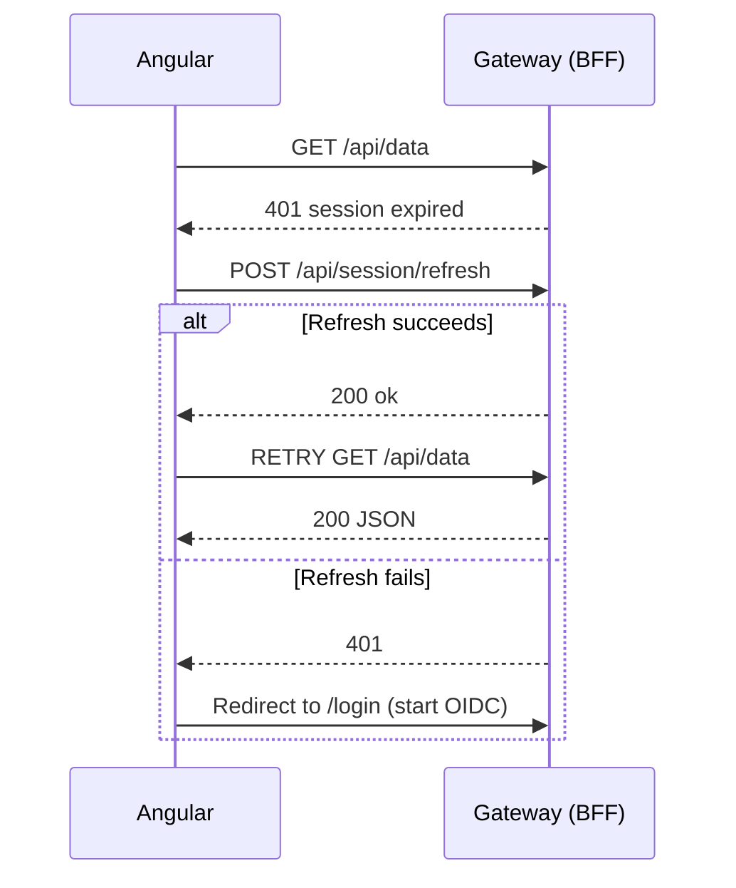
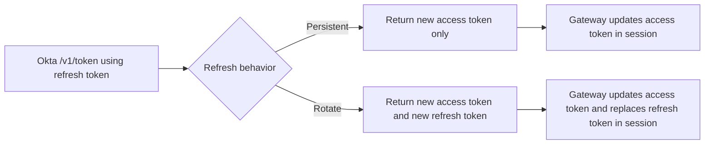
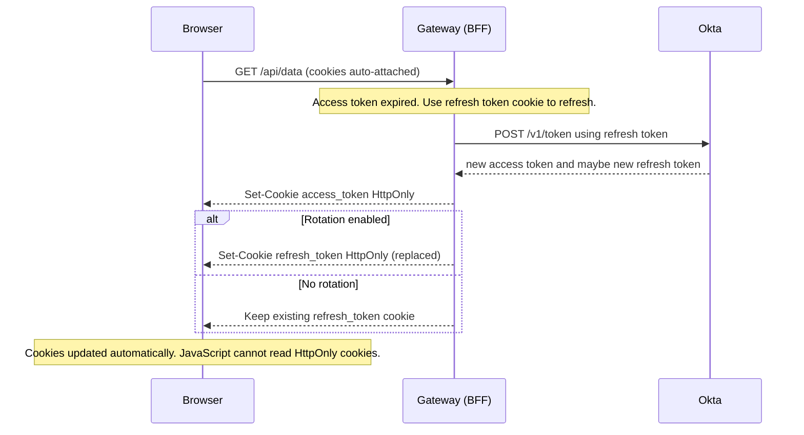

# Okta Token Refresh Flows – Mermaid Diagrams (Corrected)

This document contains all sequence and flow diagrams in Mermaid format. Diagrams **#3** and **#7** have been adjusted to avoid Mermaid parser issues (removed special characters like commas/brackets inside message lines, avoided Unicode arrows, and simplified note text).

---

## 1) First Login (OIDC Authorization Code w/ PKCE)

---

## 2) Normal API Call (AT still valid)

---

## 3) Auto-Refresh on Backend (AT expired -> refresh with RT)  **(Corrected)**

---

## 4) Optional Manual Refresh Endpoint (Keep-alive)

---

## 5) Frontend Error Interceptor (401 -> refresh -> retry)

---

## 6) Rotation vs Persistent (Refresh behavior)

---

## 7) Alternative Model — HttpOnly Cookies for AT/RT  **(Corrected)**

